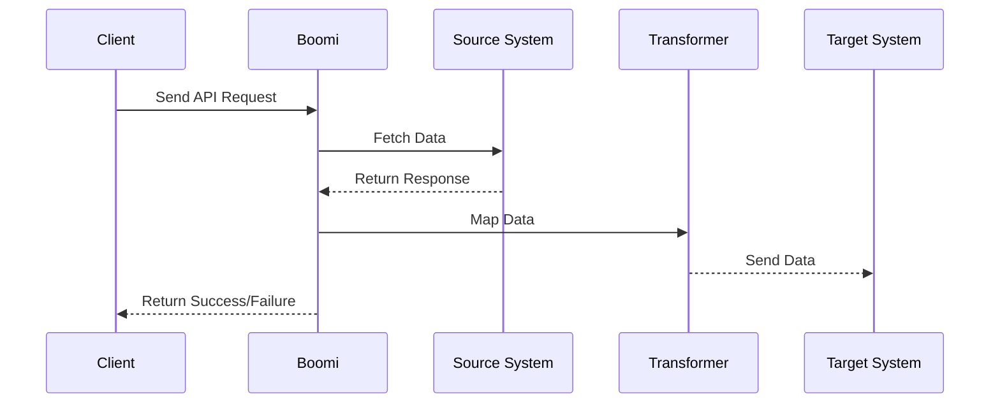

# Boomi API Integration Demo

## 📌 Purpose

This repository demonstrates **API-first integration design** as commonly implemented in Dell Boomi AtomSphere. It is designed to showcase my ability to design **robust, production-ready API integrations** with real-world considerations like authentication, error handling, and data transformation.

> ⚠️ Note: No actual Boomi processes are included. This repository illustrates **how I structure API integrations** and simulate enterprise scenarios.

---

## 🧩 Key Features Demonstrated

### 1️⃣ REST & SOAP API Integration

* **Use case:** Communicate between SaaS and internal systems.
* **Includes:**

  * Sample OpenAPI/Swagger definitions
  * Example request/response payloads
  * Authentication (OAuth 2.0, API keys)
  * Error response simulation
    
## 📂 Repository Structure

- **swagger/** – OpenAPI / Swagger files demonstrating API design
- **examples/** – Sample request/response payloads
- **diagrams/** – Flow diagrams showing integration logic

### 2️⃣ API Security & Authentication

* **Features:**

  * OAuth 2.0 flow example
  * API key validation
  * Secure header management

### 3️⃣ Data Transformation & Mapping

* **Use case:** Convert API responses into the format required by target systems.
* **Includes:**

  * JSON ↔ XML examples
  * Field mapping tables
  * Sample SQL transformation scripts

### 4️⃣ Error Handling & Retry Logic

* **Includes:**

  * Simulated failed requests
  * Retry strategies with backoff
  * Logging and alerting design

### 5️⃣ Example Flow Diagram

---

## 📝 How to Use This Repo

* Review the **OpenAPI/Swagger files** to understand API design
* Check **payload examples and transformation scripts** to see how data is processed
* Understand **error handling and retries** as applied in production integrations
* Use this as a reference for **API-led Boomi integration projects**

---

## 📬 Connect with Me

* **GitHub Profile:** [https://github.com/veronicamouli](https://github.com/veronicamouli)
* **LinkedIn:** [https://www.linkedin.com/in/veronica-chandramouli/]
* **Email:** [veronicachandramouli@gmail.com](mailto:veronicachandramouli@gmail.com)

---

⭐ This repository is part of my **enterprise Boomi integration portfolio**, showcasing **API-first integration skills** and **best practices**.
